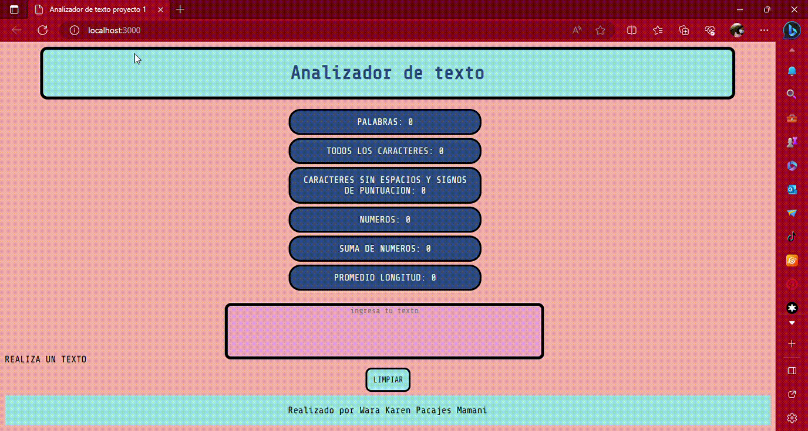

# Analizador de texto 

1. [Descripción](#descripción)
2. [Prototipo](#prototipo)
3. [Funcionalidades](#funcionalidades)
4. [Proyecto Actual](#proyecto-actual)
5. [Uso](#uso)
6. [Instalación](#instalación)

### Descripción
El Analizador de Texto es una herramienta que te permite introducir un texto y obtener diferentes análisis estadísticos sobre el mismo. Puedes contar el número de palabras, todos los caracteres, caracteres excluyendo espacios y signos de puntuación, contar los números presentes en el texto, sumar los números y obtener la longitud media de las palabras.

### Prototipo

### Funcionalidades
Almacenamiento de datos: El analizador captura automáticamente el texto ingresado mediante la acción keyup en un área de texto y lo utiliza para realizar los análisis.
Conteo de palabras: El analizador cuenta el número de palabras en el texto ingresado.
Conteo de caracteres: Se realiza un conteo de todos los caracteres en el texto.
Conteo de caracteres excluyendo espacios y signos de puntuación: Se cuentan los caracteres presentes en el texto, excluyendo espacios y signos de puntuación.
Conteo de números: El analizador detecta los números en el texto y realiza un conteo de su cantidad.
Suma de números: Si hay números en el texto, el analizador los suma y muestra el resultado.
Longitud media de palabras: Calcula la longitud promedio de las palabras presentes en el texto.
Botón de reinicio: El usuario cuenta con un botón para borrar el cuadro de texto y reiniciar los conteos para empezar nuevamente.

### Proyecto Actual

### Uso
Ingresa el texto que deseas analizar en el cuadro de texto.
Observa los resultados de los análisis debajo del cuadro de texto.
Utiliza el botón de reinicio si deseas eliminar el texto y los conteos actuales.

### Instalación
No se requiere instalación para utilizar el Analizador de Texto, simplemente accede al sitio web en el siguiente enlace:
[Enlace al proyecto](https://warakaren.github.io/src/)

